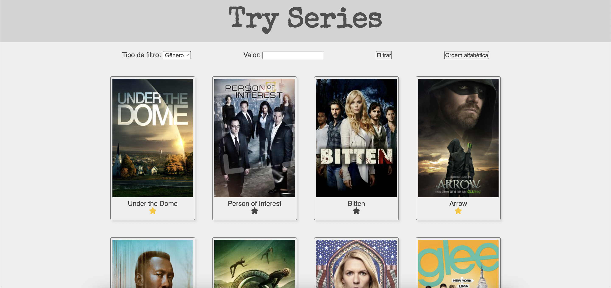

# try-series

### Termos e acordos

Ao iniciar este projeto, você concorda com as diretrizes do Código de Conduta e do
Manual da Pessoa Estudante da Trybe.

# Boas-vindas ao repositório do projeto Try Series!

Este é um projeto extra para que você pratique alguns conhecimentos obtidos no módulo de Fundamentos, o que significa que ele não será avaliado pela Trybe.

Por se tratar de um projeto extra, ele também não possui um avaliador automático, portanto, sinta-se à vontade para implementá-lo da forma que achar melhor, ou seja, solte sua criatividade! 😉

---

# Habilidades

- Manipular o DOM.

- Utilizar HoFs.

- Manipular o CSS e o HTML.

- Fazer requisições a uma API.

---

## O que deverá ser desenvolvido

- Será desenvolvida uma aplicação utilizando JavaScript, HTML5 e CSS3.

### Desenvolvimento

- Você irá desenvolver um site que lista séries de TV.

## Instruções para realizar seu projeto:

### Antes de começar a desenvolver:

1. Clone o repositório
  * `git clone git@github.com:tryber/extra-project-tryseries.git`
  * Entre na pasta do repositório que você acabou de clonar:
    * `cd extra-project-tryseries`

2. Instale as dependências e inicialize o projeto
  * Instale as dependências:
    * `npm install`

3. Crie uma branch a partir da branch `main`
  * Verifique que você está na branch `main`
    * Exemplo: `git branch`
  * Se não estiver, mude para a branch `main`
    * Exemplo: `git checkout main`
  * Agora crie uma branch à qual você vai submeter os `commits` do seu projeto
    * Você deve criar uma branch no seguinte formato: `nome-de-usuario-nome-do-projeto`
    * Exemplo: `git checkout -b joaozinho-extra-project-tryseries`

4. Adicione as mudanças ao _stage_ do Git e faça um `commit`
  * Verifique que as mudanças ainda não estão no _stage_
    * Exemplo: `git status` (deve aparecer listada a pasta _joaozinho_ em vermelho)
  * Adicione o novo arquivo ao _stage_ do Git
      * Exemplo:
        * `git add .` (adicionando todas as mudanças - _que estavam em vermelho_ - ao stage do Git)
        * `git status` (deve aparecer listado o arquivo _joaozinho/README.md_ em verde)
  * Faça o `commit` inicial
      * Exemplo:
        * `git commit -m 'iniciando o projeto x'` (fazendo o primeiro commit)
        * `git status` (deve aparecer uma mensagem tipo _nothing to commit_ )

5. Adicione a sua branch com o novo `commit` ao repositório remoto
  * Usando o exemplo anterior: `git push -u origin joaozinho-project-mistery-letter`

6. Crie um novo `Pull Request` _(PR)_
  * Vá até a página de _Pull Requests_ do [repositório no GitHub](https://github.com/tryber/extra-project-tryseries/pulls)
  * Clique no botão verde _"New pull request"_
  * Clique na caixa de seleção _"Compare"_ e escolha a sua branch **com atenção**
  * Clique no botão verde _"Create pull request"_
  * Adicione uma descrição para o _Pull Request_ e clique no botão verde _"Create pull request"_
  * **Não se preocupe em preencher mais nada por enquanto!**
  * Volte até a [página de _Pull Requests_ do repositório](https://github.com/tryber/extra-project-tryseries/pulls) e confira que o seu _Pull Request_ está criado

---

## Durante o desenvolvimento

* Faça `commits` das alterações que você fizer no código regularmente

* Lembre-se de sempre após um (ou alguns) `commits` atualizar o repositório remoto

* Os comandos que você utilizará com mais frequência são:
  1. `git status` _(para verificar o que está em vermelho - fora do stage - e o que está em verde - no stage)_
  2. `git add` _(para adicionar arquivos ao stage do Git)_
  3. `git commit` _(para criar um commit com os arquivos que estão no stage do Git)_
  4. `git push` _(para enviar o commit para o repositório remoto após o passo anterior)_
  5. `git push -u nome-da-branch` _(para enviar o commit para o repositório remoto na primeira vez que fizer o `push` de uma nova branch)_

---

## Requisitos do projeto

### 💡Veja o exemplo a seguir de como o projeto pode se parecer depois de pronto. Lembre-se que nesse projeto você pode e deve ir além para deixar o projeto com a sua cara e impressionar a todas as pessoas!

### Informações importantes:

* [Documentação da API TV Maze](https://www.tvmaze.com/api)

  * Lembre-se de ler a documentação e analisar o formato dos dados retornados pela API para que você possa transformá-los e utilizá-los da forma que for mais apropriada pra você! :)

## Sugestões para a construção da página:

**Lembrando, os requisitos abaixo são sugestões para a construção da página! Se desejar, você pode alterar a implementação da forma que achar mais interessante! :)**

**Sinta-se à vontade para utilizar frameworks CSS e bibliotecas externas para deixar o seu projeto com a sua cara! :)**

### 1 - Construir um cabeçalho que contenha o título da sua página.

**Aqui você pode soltar sua criatividade e utilizar a fonte e as cores que desejar. Além disso, o nome do projeto é apenas uma sugestão, se quiser dar um título diferente, sinta-se à vontade! 😀**

### 2 - Implementar a função `fetchSeries` que se encontra dentro do diretório `helpers`.

**O que poderá ser feito:**

- Realizar uma chamada assíncrona à API `TV Maze` por meio do endpoint `https://api.tvmaze.com/shows` e retonar os dados para que eles possam ser utilizados pelo script da página HTML.

### 3 - Crie uma seção na página com campos para filtrar e ordenar as séries de TV.

Sugestões de campos:

- Um `select` que permita escolher qual o filtro iremos aplicar na listagem;
  - Esse `select` poderá conter, por exemplo, as opções de filtar por **Gênero**, **Nome**, **Idioma** etc.
- Um `input` para que a pessoa usuária entre com um determinado valor para a realização do filtro. Exemplo: gênero da série;
- Um botão para realizar a ação de filtrar;
- Um botão que ordene a lista em ordem alfabética;

**Lembrando mais uma vez que você pode usar sua criatividade e ir além das sugestões dadas acima!**

### 4 - No arquivo `script.js`, chamar a função criada em `fetchSeries.js` para que os dados retornados pela API possam ser utilizados para a criação dos _cards_ de cada série de TV.

  * Lembre-se de analisar e interpretar como esses dados são retornados pela API para que você possa utilizar as propriedades desejadas para a construção desses _cards_. Para isso, pergunte-se: 
    * Qual propriedade possui a imagem que eu desejo mostrar na tela? 
    * Essa propriedade está dentro de um outro objeto? 
    * Se sim, qual objeto? 
    * Qual a propriedade traz o nome da série? 
  * Para responder essas perguntas, faça um `console.log` ou "debugue" o seu código analisando esses dados.

### 5 - Adicione um escutador do evento de clique ao botão de filtro.

  * Caso você tenha seguido as sugestões dadas acima para o `select` de tipo de filtro, você poderá implementar nessa função escutadora do evento uma forma de decidir qual o tipo está selecionado no momento. A partir desse filtro selecionado, você poderá fazer a ação de filtrar de forma adequada.

  **🏅Dica de ouro🏅: Faça com que a função escutadora de evento chame outras funções baseada no filtro selecionado no momento e passando o valor necessário para essa função que será chamada (ou seja, o que foi digitado no `input`). Dessa forma, você deixa o seu código mais modular e garante uma maior legilidade.**

  **🏅Dica de ouro 2🏅: Quando for realizar o filtro, analise os dados retornados pela API para que você possa implementar a função corretamente. Por exemplo, caso queira filtrar por gênero, verifique como esse dado é fornecido pela API para que você faça o filtro corretamente.**

  **🏅Dica de ouro 3 (quantas dicas de ouro, hein?!)🏅: Utilize HoFs! 😉**

### 6 - Adicione um escutador do evento de clique ao botão de ordenar a lista.

  * Você pode utilizar a função [sort](https://developer.mozilla.org/pt-BR/docs/Web/JavaScript/Reference/Global_Objects/Array/sort) e passar uma `callback` para ela implementndo a lógica de ordenação.

### 7 - Adicione um ícone no _card_ que permita "favoritar" suas séries preferidas.

  * Você pode utilizar o kit [Font Awesome](https://fontawesome.com/) para colocar ícones na sua página. Para isso, siga as instruções no site para utilizá-la.
  * Adicione um escutador de eventos a esse ícone e altere seu estilo quando ele for clicado para deixar o visual mais legal! :)
  * Caso queira que essa informação fique guardada, que tal armazenar todas as séries "favoritadas" no local storage? Dessa forma, ao recarregar a página, você poderá verificar quais são suas séries favoritas e marcá-las novamente com o ícone de favorito ativado! :)

---
